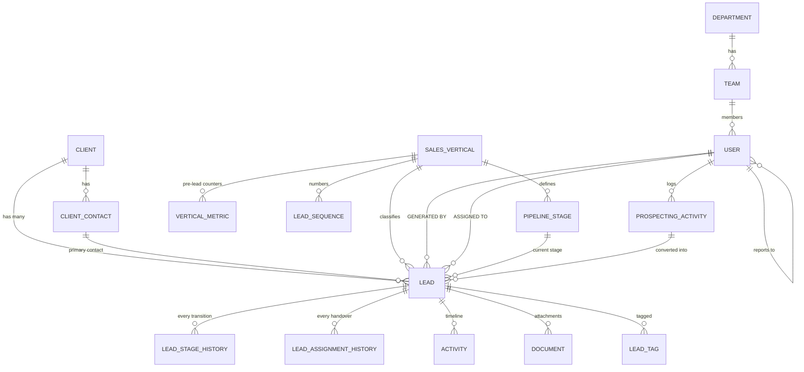
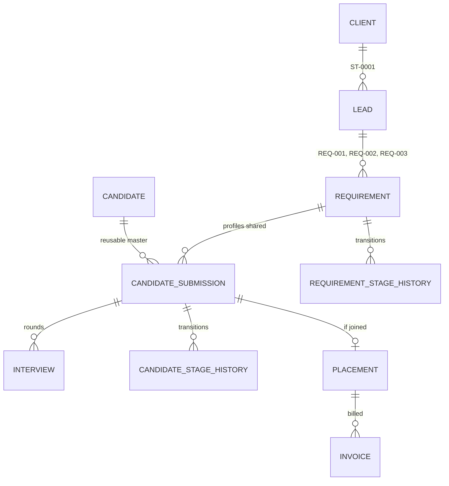
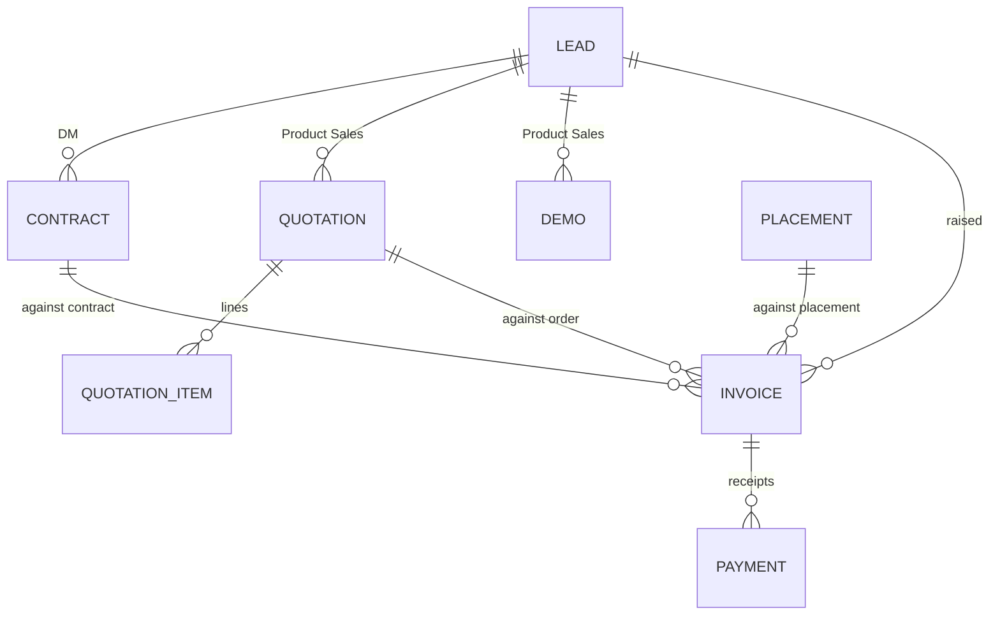

# Data Model

Executable schema: [`prisma/schema.prisma`](../prisma/schema.prisma) — 47 models.
This document explains the shape and the reasoning.

---

## 1. Core — Client, Lead, Ownership



### The two ownership fields

`Lead.generatedById` and `Lead.assignedToId` are separate columns with separate
foreign keys and separate indexes. README §6.3 and §37 both insist on this, and
it is what makes the BDE-vs-BDM performance split possible:

- **BDE Performance** (§27) queries `WHERE generatedById = ?`
- **BDM Performance** (§28) queries `WHERE assignedToId = ?`

`LeadAssignmentHistory` keeps every handover, so reassigning a lead never erases
who originally sourced it.

### One stage field, one derived bucket

`Lead.currentStageId` points at a stage belonging to the lead's own vertical.
`Lead.commonStage` is written by the same transaction and holds the bucket that
stage maps to. The user types one thing; the cross-vertical chart reads the other
(decision D5). The application enforces that the two never diverge —
`commonStage` is never editable by hand.

`Lead.status` (`OPEN` / `WON` / `LOST`) is likewise derived from the stage's
`isWon` / `isLost` flags, so "how many did we win" never depends on someone
remembering to set a second field.

### Lead codes

`LeadSequence` is keyed on `(verticalId, year)` and incremented inside the same
transaction that inserts the lead, using `UPDATE … RETURNING`. That gives
gap-free `UP-0001`, `ST-0042` codes with no race between concurrent BDEs.

Codes that are neither per-vertical nor per-year — `CL-0001` for clients, and
`REQ-`/`INV-` later — come from `NumberSequence`, a generic `key → lastNumber`
counter allocated the same way. Both are issued through `src/lib/codes.ts`,
always inside the caller's transaction: a code allocated outside the insert it
belongs to survives a rollback and shows up later as an unexplained gap.

### De-duplication

The flowchart's intake band runs De-duplication → Validation → Assignment →
Notification. `Client.dedupeKey` (normalised company name + email domain) is
unique, and on lead creation the API also warns on matching contact email, phone
and company LinkedIn. The user can override with a reason, which is audited.

---

## 2. Staffing — the three-level hierarchy



This is the structure README §13 explicitly asks for: *"The CRM should not create
a completely separate client record every time the same client raises another
requirement."*

- **Requirement** carries `openings`, `positionsFilled`, its own stage, its own
  `status` and its own `lostReasonId` — outcome lives here (decision D8).
- **Candidate** is a master. The same person submitted to three clients is one
  candidate and three submissions, so `Candidates Sourced` stays honest.
- **CandidateSubmission** is the join carrying per-requirement progress, unique
  on `(requirementId, candidateId)` so nobody double-submits.
- **Placement** is the revenue unit — one row per candidate who actually joins.
  A 3-opening requirement filled completely produces 3 placements.

`Lead.status` for a staffing lead is recomputed whenever any of its requirements
closes: WON if at least one is filled, LOST if all are lost, otherwise OPEN.

---

## 3. Commercials



An invoice can originate from a contract (Digital Marketing), an accepted
quotation (Product Sales) or a placement (Staffing) — hence three nullable
parents, exactly one of which is set.

`Invoice.amountReceived` and `amountPending` are maintained by the application on
every payment insert/update/delete, inside the same transaction, so the dashboard
never has to aggregate `Payment` at read time. `status` follows:

| Condition | Status |
|---|---|
| `amountReceived = 0` and `dueDate ≥ today` | PENDING |
| `0 < amountReceived < totalAmount` | PARTIALLY_PAID |
| `amountReceived ≥ totalAmount` | PAID |
| `amountPending > 0` and `dueDate < today` | OVERDUE |

A nightly job re-evaluates OVERDUE, since it turns over with the calendar rather
than with a user action.

---

## 4. Cross-cutting tables

| Table | Purpose | README |
|---|---|---|
| `Activity` | The chronological timeline on the lead page. Attaches to a lead, client, requirement or candidate | §23 |
| `Document` | Uploads at any level, typed (`PROPOSAL`, `RESUME`, `INVOICE`…) | §36 |
| `AuditLog` | user / action / timestamp / old value / new value on every critical change | §35 |
| `Notification` + `NotificationRule` | Role-based reminders and alerts | §31 |
| `SavedView` | Named filter combinations on the lead list | §30 |
| `RolePermission` | Per-role capability toggles over the fixed 5 roles | §32, §33 |
| `AutomationRule` | Stub for the flowchart's "Automations & Workflows" panel; inert in v1 | — |

Stage changes are written to **both** `LeadStageHistory` (for metrics) and
`AuditLog` (for compliance). They answer different questions and are queried very
differently, so duplicating the fact is deliberate.

---

## 5. Visibility rules (decision D7)

Every list query is wrapped by a scope filter resolved from the signed-in user:

| Role | Sees |
|---|---|
| `ADMIN` | everything |
| `BDM` | own records + every user in teams they manage + their whole reporting sub-tree |
| `BDE` | leads where they are `generatedById` **or** `assignedToId` |

The BDM row is not a widening. `visibleUserIds` always ran BDM and the former
MANAGER down the same branch — full sub-tree plus managed teams — so the earlier
"direct reports' records" here described the intent rather than the code. With
MANAGER gone (D13) the two descriptions collapse into the one the code has always
implemented.

The sub-tree is resolved with a recursive CTE over `User.reportingManagerId`,
cached per request:

```sql
WITH RECURSIVE subtree AS (
  SELECT id FROM "User" WHERE id = $1
  UNION ALL
  SELECT u.id FROM "User" u JOIN subtree s ON u."reportingManagerId" = s.id
)
SELECT id FROM subtree;
```

This is applied server-side in a single shared helper, never assembled per
endpoint — visibility bugs in a CRM are the kind that get noticed by the wrong
person.

**Clients are scoped slightly wider than leads.** A client is visible to its
owner *and* to anyone who can see one of its leads: a BDE who sourced `UP-0042`
has to be able to open the account page to add the contact they just spoke to.
An unowned client with no leads is therefore visible only to an Admin, which is
the right default and is fixed by setting an owner.

---

## 6. Indexing strategy

The dashboard is the heaviest reader, so indexes follow its filters:

- `Lead(verticalId, commonStage)` — the pipeline overview chart
- `Lead(status, verticalId)` — won/lost by vertical
- `Lead(generatedById)`, `Lead(assignedToId)` — BDE and BDM performance
- `Lead(createdAt)`, `Lead(nextFollowUpAt)` — date-range filters and follow-up queues
- `LeadStageHistory(toStageId, changedAt)` — every conversion percentage
- `Invoice(status, dueDate)` — overdue detection
- `ProspectingActivity(verticalId, activityDate)` — counter roll-ups

If volumes turn out larger than assumed (open question Q5), a nightly
`MetricSnapshot` roll-up table can be added without touching the write path.

---

## 7. Soft delete

`Lead`, `Client`, `Requirement` and `Candidate` carry `isDeleted`. Nothing is
physically removed — a CRM that loses history loses its reason to exist. Admin
can restore; the action is audited either way.
